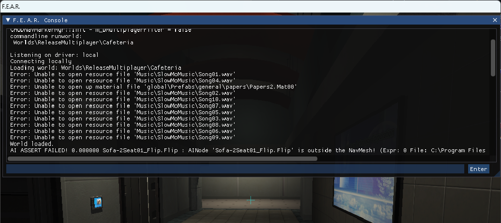

# F.E.A.R. Console Reimplementation



## How to install
Download the release and extract ``msacm32.dll`` to the F.E.A.R. dev Runtime directory. Replace the .dlls  in the ``Runtime\Game`` directory with ones in the release: [``releases/latest``](https://github.com/burmaraider/FEAR_Console/releases/latest)

## What it is
This is a reimplementation of the F.E.A.R. console using the msacm32.dll as an entry point. The provides a basic console you can interact with, with the tilde ```~``` key. The console is not fully functional, but it is a start.

## What commands don't work?
The good ones, like ``Wireframe`` and ``VisLock`` and ``VisDrawPortals``, these have been disabled in the renderer.

## Issues
Run the game in windowed mode ``+windowed 1`` and do not change the resolution in game, we are currently not handling the reset functions in D3D9. This will only work with the provided .dlls

## Notes
  This is a work in progress. I am not affiliated with Monolith Productions in any way.